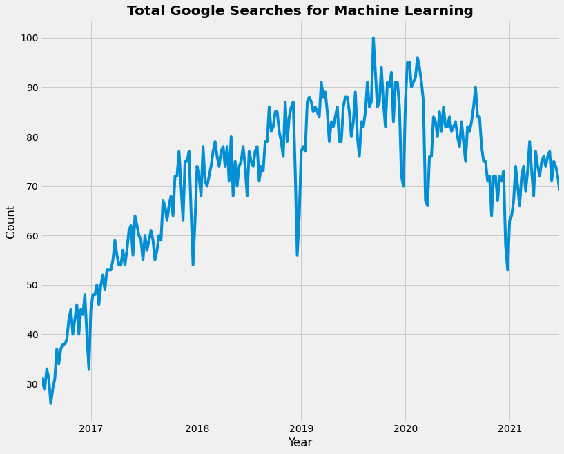

<h3> Google Search is a great use case for analyzing data based on search queries.</h3> 
* In this project, I have tried to find the top 10 countries which search the word "Machine Learning". 
* I have also tried to plot the trend of seaches of this particular word in recent years.    

To access the data, we have to use a Python library called **_pytrends_**. To install it, run **_pip install pytrends_**.  

<h4> The trend can be seen as below: </h4> 

* We can see that the searches for "Machine Learning" increased since 2017 and the highest searches were done in 2020.  
* In this way, we can analyze the Google Search data. Business can use similar techniques and increase their revenues by understanding what actually people are looking for on Google at a given time.  

_**Thanks!!**_
